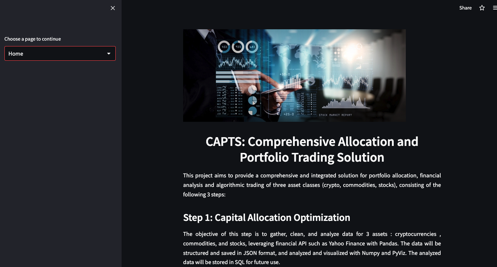
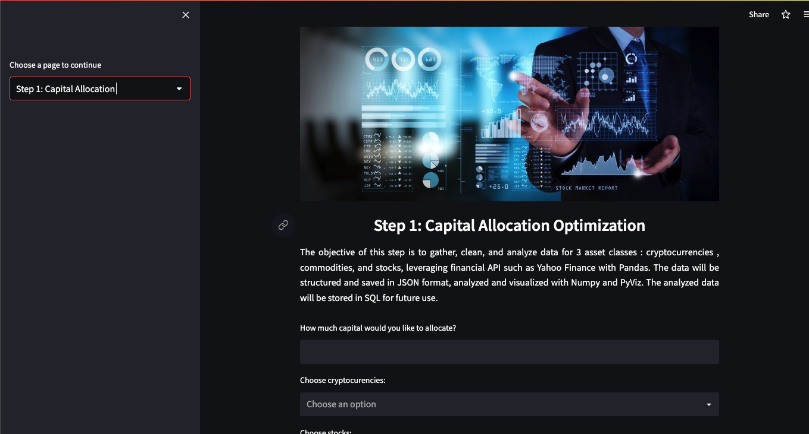
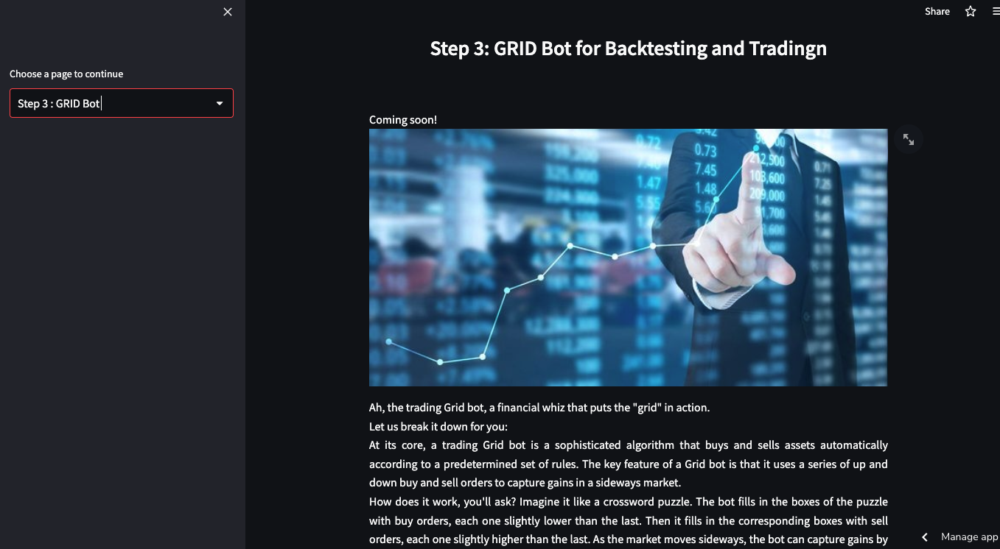

# Capital_Allocation_Optimization

# Project Title

The project is aimed at providing users with a reliable tool to make informed investment decisions across 3 asset classes (crypto, commodities, and stocks). The first step involves collecting and cleansing data from financial APIs, such as Yahoo finance, using Pandas. Once the data is cleaned, Monte Carlo simulation is employed to analyze it and calculate essential metrics, such as returns, volatility, and Sharpe ratio, for each asset class.

The simulation generates arrays of portfolios for each asset class with asset allocations, which the user can select from. Two optimal portfolios are identified for each asset class: one with the maximum Sharpe ratio, offering higher returns but also higher risk, and the other with minimum volatility, offering greater stability, but lower returns.

After selecting the preferred portfolio, the project runs a second layer of Monte Carlo simulation to determine the asset allocation for each asset class. This enables users to make informed investment decisions based on their risk tolerance and investment goals.

Overall, the project provides a comprehensive, data-driven approach to investment decision-making that empowers users to make informed choices based on actual data, instead of relying solely on gut feelings or traditional financial advice.


---

## Technologies

This application is written with Python 3.7 and uses:
   * Jupyter notebook
   * pandas library
   * pathlib module
   * %matplotlib inline
   * yfinance
   * numpy
   * scipy.optimize
   * streamlit
   * holoviews
   * hv.extension('bokeh')
   * json 
   * sqlite3
   

---

## Installation Guide

1. To ceate new conda development environment run the following code in terminal :
```python
conda create --name anaconda
```
2. To install Jupyter lab: 
```python
conda pip install jupyterlab
```
3. To install Pandass lybrarie:
```python
conda pip install pandas
```
4.  To install yfinance lybrarie:
```python
conda pip install yfinance
```
5.  To install install scipy lybrarie:
```python
cconda install scipy
```
6.  To install install streamlit lybrarie:
```python
conda pip install streamlit
```
7.Open **capital_allocation_optimization** file in Jupyter notebook.  


[The application is deployed as a web page on streamlit:](https://capital-allocation-optimizationstreamlit-front-end-ca-ofp0v6.streamlit.app/)

Here are the screenshots of the pages:


  

Capital Allocation Optimization:




)
---

## Instructions

To get started, please input the amount of capital you intend to invest and press the "Enter" button. Next, specify the desired time horizon for your analysis, and press "Enter." The Monte Carlo Model will generate multiple portfolios, each with different asset allocations. The model will provide valuable insights on the Returns, Volatility, Sharpe ratios, and portfolio weight distribution for three asset classes: Crypto, Stocks, and Commodities.

Then pie charts will be generated for both the Maximum Sharp Ratio and minimum volatility portfolios for each asset class, indicating the asset allocation. Furthermore, scatter plots will depict projected portfolio returns against risk, enabling you to evaluate the performance of each asset class.

By utilizing this information, you can make informed investment decisions and determine the optimal funds to allocate to each asset class to achieve your investment objectives.
---

## Contributors
Alexander Likhachev, Alphonso Logan, Cary Gutknecht, Markeis Reed, Julio Rod 


---

## License

MIT

